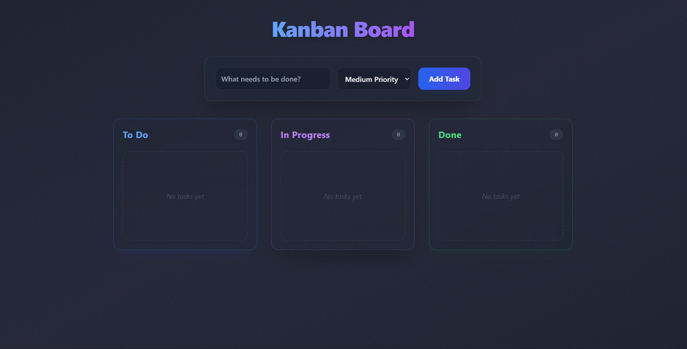

# Kanban Task Board

A stylish, responsive, and intuitive Kanban board application built with React and Tailwind CSS. This project helps users manage their tasks efficiently with drag-and-drop-like functionality (via select), priority levels, and persistent storage.

---

## 📑 Table of Contents
- [Preview](#-preview)
- [Demo](#-demo)
- [Features](#-features)
- [Technologies Used](#-technologies-used)
- [Installation](#-installation)
- [Usage](#-usage)
- [How It Works](#-how-it-works)
- [Responsive Design](#-responsive-design)
- [Acknowledgments](#-acknowledgments)
- [Contact](#-contact)

---

## 📸 Preview

| Desktop View | Mobile View |
|:---:|:---:|
|  |  |

> *Note: Please add `desktop-preview.png` and `mobile-preview.png` to the `Screenshots/` directory.*

---

## 🚀 Demo
Check out the live version here:  
👉 **[Live Demo Link](https://kanban-task-board-phi.vercel.app/)**

---

## ✨ Features

- 📋 **Smart Task Management**: Create, edit, and categorize tasks into "To Do", "In Progress", and "Done".
- 🏷️ **Priority Levels**: Assign priorities (High, Medium, Low) with visual color coding.
- 💾 **Persistent Data**: Uses Local Storage to save your tasks, so they remain available even after refreshing the page.
- 🎨 **Premium UI**: Features a modern, glassmorphism-inspired design with smooth animations and gradients.
- 📱 **Fully Responsive**: Seamless experience across desktop (side-by-side columns) and mobile (stacked layout).
- ✏️ **Inline Editing**: Click on any task title to instantly edit its content.
- 🗑️ **Easy Cleanup**: Quickly delete tasks with a hover-reveal delete button.

---

## 🛠 Technologies Used

-   **React**: Component-based UI library for building interactive interfaces.
-   **Tailwind CSS**: Utility-first CSS framework for rapid and responsive styling.
-   **Vite**: Next-generation frontend tooling for fast development and build processes.
-   **JavaScript (ES6+)**: `async/await`, Local Storage API, functional components.
-   **Glassmorphism**: Custom CSS techniques for frosted glass effects.

---

## 🚀 Installation

1.  **Clone the repository**:
    ```bash
    git clone https://github.com/AyushVyas3925/Kanban-Task-Board.git
    cd Kanban-Task-Board
    ```

2.  **Install Dependencies**:
    ```bash
    npm install
    ```

3.  **Run the Development Server**:
    ```bash
    npm run dev
    ```
    *   The app will launch at `http://localhost:5173` (or similar).

4.  **Build for Production**:
    ```bash
    npm run build
    ```

---

## 📖 Usage

1.  **Add a Task**: Type your task in the input field, select a priority, and click **"Add Task"**.
2.  **Move Tasks**: Use the dropdown menu on each task card to move it between columns (To Do -> In Progress -> Done).
3.  **Edit Tasks**: Click directly on the task text to edit it. Press `Enter` or click outside to save.
4.  **Delete Tasks**: Hover over a task card and click the **"X"** button to remove it.
5.  **Refresh**: Your tasks will be saved automatically!

---

## 🧠 How It Works

1.  **State Management**: React `useState` hooks manage the list of tasks and input form state.
2.  **Effect Hooks**: `useEffect` listens for changes in the `tasks` state and syncs them to `localStorage`.
3.  **Component Architecture**: Currently split into `App.jsx` (container & logic), `Column.jsx` (category display), and `TaskCard.jsx` (individual item).
4.  **Styling**: Tailwind utility classes handle layout (Flexbox/Grid), spacing, and colors. Custom "glass" classes provide the aesthetic overlay.
5.  **Responsiveness**: Media queries (via Tailwind's `md:`, `lg:`) adjust the main container from a column layout on mobile to a row layout on desktop.

---

## 📱 Responsive Design

-   **Mobile**: The "Add Task" bar stacks vertically for easy thumb access. Columns stack one below the other.
-   **Desktop**: The interface expands to show all three columns side-by-side for a complete overview.
-   **Adaptive**: Glassmorphism effects and font sizes adjust to remain readable on all screen sizes.

---

## 👏 Acknowledgments

-   **Vite**: For the incredibly fast dev server.
-   **Tailwind CSS**: For making styling efficient and beautiful.
-   **React Community**: For the endless resources and support.

---

## 📬 Contact

**Ayush Vyas**

-   📧 Email: s.ayushvyas3925@gmail.com
-   🔗 LinkedIn: [Ayush Vyas](https://www.linkedin.com/in/ayush-vyas-287980286/)

---
*Created for the Week 5 Project.*
